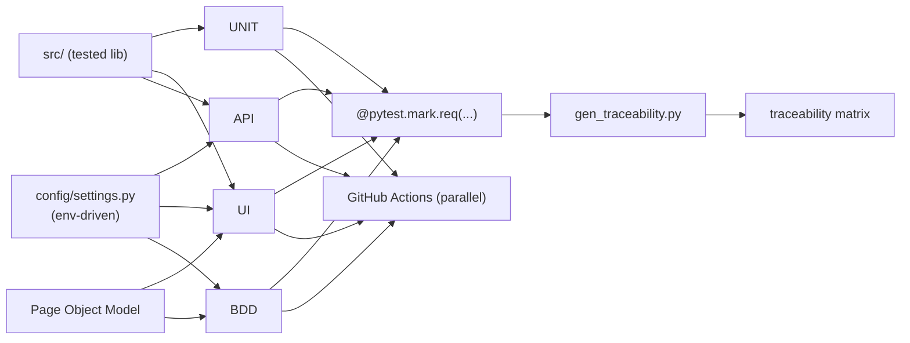
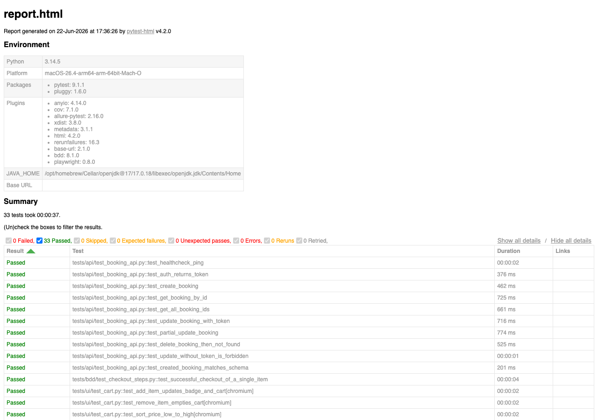

# QA Automation Framework

> Multi-layer test automation framework — **UI E2E, REST API, unit** — with a
> living **requirements-to-tests traceability matrix**, inspired by
> critical-systems QA practice (avionics-grade discipline applied to a public
> demo target).

<!-- Replace YOUR_GITHUB_USERNAME below after you push (one sed command is in the
     "Push to GitHub" section). -->

[](https://codecov.io/gh/YOUR_GITHUB_USERNAME/qa-automation-framework)


---

## Why this project

I build software-test automation for **safety- and quality-critical systems**.
During my apprenticeship at CEA on the EUCLID space telescope (ESA/CNES
high-criticality environment) I worked with unit testing, SonarQube, CI
pipelines and, above all, **requirements traceability** — every test exists to
verify a stated requirement.

This repository applies that mindset to a clean, runnable, public example. It is
not "a few tests": it is a structured framework where **every test is traced
back to a requirement**, the traceability matrix is **generated from the live
suite and verified in CI**, and the whole thing runs in one command locally or
in a container.

## Test layers

| Layer | Tool | Target | What it proves |
|---|---|---|---|
| **UI E2E** | Playwright + Page Object Model | [SauceDemo](https://www.saucedemo.com) | Login, cart, sorting, full checkout (totals cross-checked against tested logic), form validation, logout. |
| **REST API** | httpx + Pytest + JSON Schema | [restful-booker](https://restful-booker.herokuapp.com) | Auth token, full CRUD, negative auth (403), contract/schema validation, health check. |
| **Unit** | Pytest + coverage (≥90% gate) | `src/` support library | Pricing logic, schema validation, data builders — the logic the UI/API layers rely on. |
| **BDD** | pytest-bdd (Gherkin) | SauceDemo (via the same POM) | A business-readable checkout scenario, no duplicated automation code. |

**33 tests** across the four layers, **100% coverage** on `src/`,
**24 requirements** mapped with **zero gaps**.

## Architecture

See [docs/architecture.md](docs/architecture.md) for the full diagram and design
rationale.



## Requirements traceability (the differentiator)

Every test declares the requirement it verifies:

```python
@pytest.mark.ui
@pytest.mark.smoke
@pytest.mark.req("REQ-UI-06")
def test_full_checkout_totals_and_confirmation(inventory_page):
    ...
```

`scripts/gen_traceability.py` collects those markers from the **live suite**,
cross-checks them against the requirements registry
([docs/requirements.json](docs/requirements.json)), and generates
[docs/traceability_matrix.md](docs/traceability_matrix.md) (+ CSV). It flags:

- **Gaps** — a requirement with no test.
- **Orphans** — a test referencing an unknown requirement.

A dedicated CI job runs it in `--check` mode, so the matrix **can never silently
drift** from the code.

| Req ID | Layer | Requirement | Level | Status | Test |
|---|---|---|---|---|---|
| REQ-UI-06 | UI | Full checkout confirms order; subtotal/tax/total are correct | smoke | COVERED | `tests/ui/test_checkout.py::test_full_checkout_totals_and_confirmation` |
| REQ-API-08 | API | Updating a booking without a token is rejected with 403 | regression | COVERED | `tests/api/test_booking_api.py::test_update_without_token_is_forbidden` |
| … | | _full table in [traceability_matrix.md](docs/traceability_matrix.md)_ | | | |

## How to run

### Local (virtualenv)

```bash
python -m venv .venv && source .venv/bin/activate
pip install -e ".[dev]"
python -m playwright install --with-deps   # browsers for UI/BDD

cp env.example .env        # optional: defaults already point at the demo targets

make test                  # full suite (unit + api + ui + bdd)
# or target a layer / subset:
make unit                  # unit tests + coverage gate
make api                   # API tests
make ui                    # UI tests (headless, artifacts on failure)
make bdd                   # BDD scenario
pytest -m smoke            # fast cross-layer smoke subset
make trace                 # regenerate the traceability matrix
```

### Docker (reproducible)

```bash
make docker                                  # build the image
docker run --rm qa-framework pytest -m "unit or api"
```

## Reports & flakiness handling

- **pytest-html** self-contained report at `reports/report.html`.
- **Allure** results at `reports/allure-results` (`allure serve reports/allure-results`).
- On UI failure: **screenshot + video + Playwright trace** are captured and
  uploaded as CI artifacts.
- Flakiness from the public demo services is absorbed with **explicit waits**
  (Playwright auto-wait / `expect`), **reruns** (`pytest-rerunfailures`), and a
  **wake-up ping** for the Heroku-hosted API.



## CI/CD

GitHub Actions runs on every push and pull request, with **parallel jobs**:

`lint` · `unit (+coverage)` · `api` · `ui` (matrix: **chromium / firefox /
webkit**) · `bdd` · `traceability (--check)` · `perf` (k6, informational).

See [.github/workflows/ci.yml](.github/workflows/ci.yml).

## Bonus

- **BDD** — Gherkin scenario ([checkout.feature](tests/bdd/features/checkout.feature)).
- **Cross-browser** — UI suite parametrized over Chromium, Firefox and WebKit.
- **Performance** — light k6 load test with explicit SLOs ([perf/booking_load.js](perf/booking_load.js)).

## Project structure

```
config/        env-driven settings (pydantic-settings)
src/           tested support library (pricing, schema, builders)
tests/ui/      Page Object Model + UI tests
tests/api/     httpx client + API tests + JSON schemas
tests/unit/    unit tests (coverage target)
tests/bdd/     Gherkin feature + step definitions
scripts/       traceability matrix generator
docs/          architecture, requirements registry, traceability matrix
perf/          k6 load test
.github/       CI workflow
```

## Roadmap

- Publish the Allure report to GitHub Pages.
- Add contract tests against an OpenAPI spec.
- Visual regression checks (Playwright snapshots).

## Author

**Mohamed Kaouane** — Test & Automation Engineer, focused on critical civil
systems (automotive/embedded, industrial IoT, railway, energy).
ISTQB Foundation (in progress).
