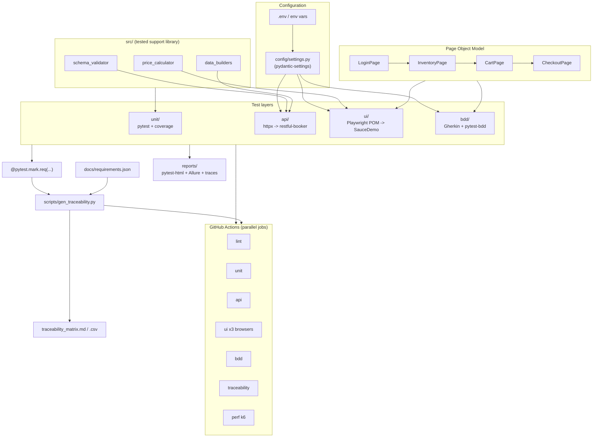

# Architecture

The framework is organised in four independent test layers driven by a shared
configuration and a common set of pytest markers. A traceability generator sits
on top, reading the `@pytest.mark.req(...)` markers off the live suite to keep
the requirements matrix honest.

## Design choices

| Concern | Decision | Why |
|---|---|---|
| UI target | SauceDemo | Stable, designed for automation, clean e-commerce flow for requirement mapping. |
| API target | restful-booker | Full CRUD + token auth + a real booking domain (stateful workflow). |
| Config | pydantic-settings, env-driven, safe defaults | Runs out of the box; overridable per environment without code changes. |
| Coverage meaning | unit tests target `src/`, reused by UI assertions | Coverage measures real logic, not throwaway code. |
| Traceability | generated from live markers, CI-verified | Cannot silently drift — mirrors critical-systems QA practice. |
| Flakiness | Playwright auto-wait, reruns, Heroku wake-up ping, failure artifacts | Robust against external demo-service variability. |
